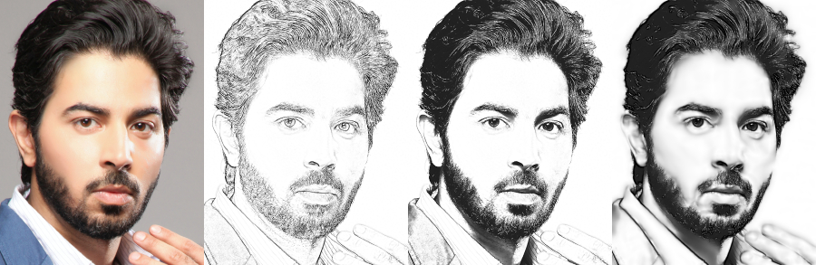
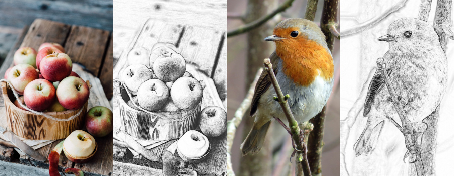
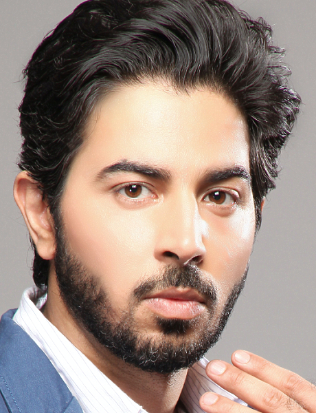
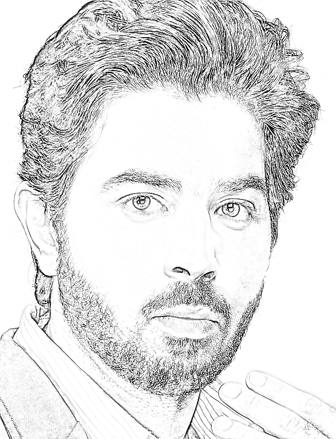
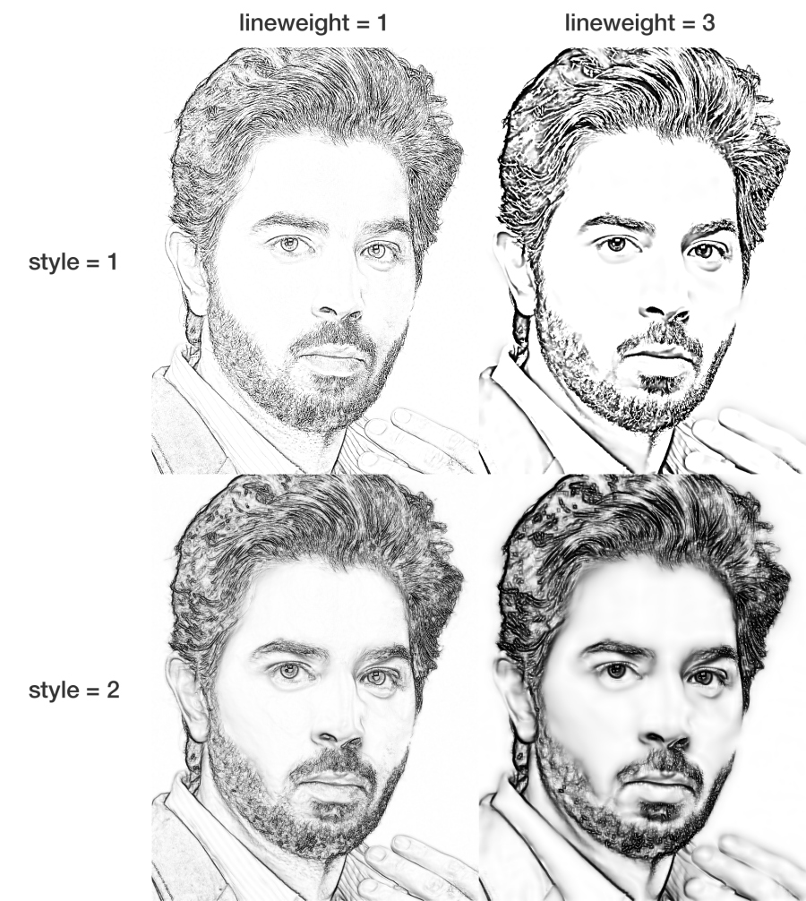
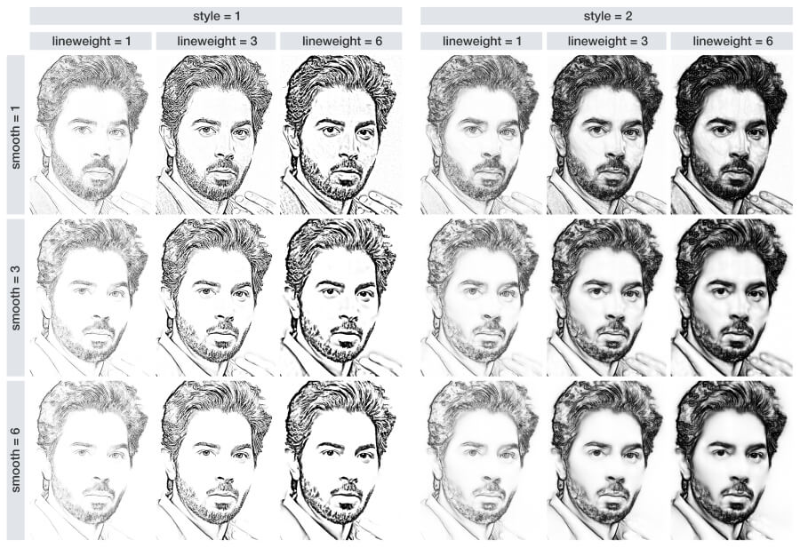
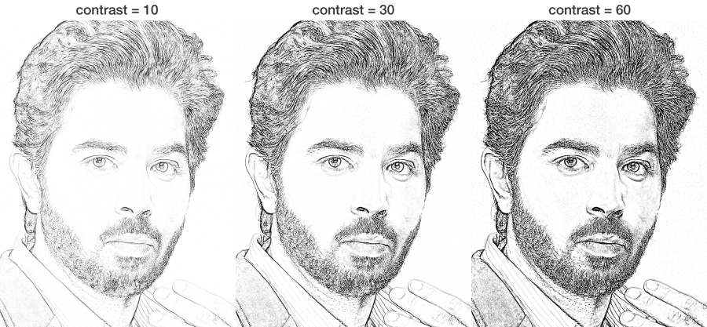
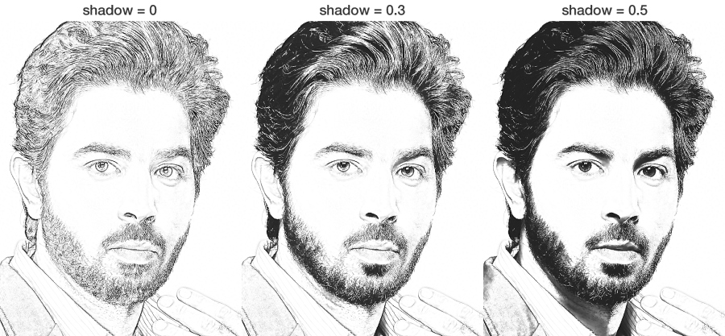

<!-- README.md is generated from README.Rmd. Please edit that file -->

```{r, include = FALSE}
knitr::opts_chunk$set(
  collapse = TRUE,
  comment = "#>",
  fig.path = "notes/figures/",
  out.width = "100%",
  dpi=130
)
```

# sketcher

<!-- badges: start -->
<!-- badges: end -->

By using the ```sketcher``` package, you can convert a photo into a line drawing image.  
Drawing style (lineweight and inclusion/exclusion of shadow/shading) can be controlled.  
Some example results are shown below.

<p></p>

<p></p>

## Paper

Details of this package are described in the article below:

Tsuda, H. (2020). sketcher: An R package for converting a photo into a sketch style image.  
https://psyarxiv.com/svmw5


## Dependencies

Mac OS X users need to install XQuartz (https://www.xquartz.org/).

## Installation

Please use the ```devtools``` package to install the ```sketcher``` package.

``` r
devtools::install_github("tsuda16k/sketcher")
```

(__NOTE:__ The ```sketcher``` package is currently under review by CRAN, so install.packages("sketcher") command does not work.)

Then, attach the package.

```{r}
library(sketcher)
```

## Example image

The ```sketcher``` package has a built-in image, which is useful when you want to try sketch effects right away. The image data is named  ```face```.

Internally, this is just a numeric array of size 600 x 460 x 3 [y-coordinate, x-coordinate, color channel]. Each element of the array represents a pixel value, which can range between 0 and 1.

```{r}
dim(face)
```

To plot an image, use the ```plot()``` function.

```{r, eval=FALSE, echo=TRUE}
plot(face)
```



(In examples below, I actually used <a href="notes/sketcher_face.jpg">this image</a>, which has higher resolution than the provided by the package. Sketch results will be similar, but in general aesthetically more pleasing results can be obtained with images of higher resolution, at the cost of processing time.)

## Load an image

To load your own image, use the ```im_load()``` function.

```{r, eval=FALSE, echo=TRUE}
im = im_load("path/to/your/image.jpg")
plot(im)
```

The jpg, png, and bmp formats are supported.

You can load an image from the web (URL). For example, 

```{r, eval=FALSE, echo=TRUE}
im = im_load("https://raw.githubusercontent.com/tsuda16k/sketcher/master/notes/sketcher_face.jpg")
```

will load a high resolution version of the face image noted above (compare ```dim(face)``` and ```dim(im)```).

## Apply the sketch effect

The built-in face image is used in the following examples.  
For consistency purposes, the ```face``` image is labeled as ```im```.

```{r}
im = face
```

Use the ```sketch()``` function to apply the sketch effect to an image.

```{r, eval=FALSE, echo=TRUE}
im2 = sketch(im) # may take some seconds
plot(im2)
```

<p></p>

That's all.

The ```sketch()``` function has several parameters to control the style of sketch.

## Arguments of the sketch() function

A table of arguments of the ```sketch()``` function:

```{r echo = F, results = 'asis'}
Argument = c("im", "style", "lineweight", "smooth", "gain", "contrast", "shadow", "max.size")
Meaning = c( "An input image", "Sketch style", "Strength of lines",
             "Smoothness of texture", "Gain parameter", "Contrast parameter", "Shadow threshold",
             "Max resolution of output" )
Value = c( "image", "1 or 2", "a numeric, >= 0.3", "an integer, >= 0", "a numeric betw 0 and 1", "a numeric, >= 0",
           "a numeric betw 0 and 1", "an integer, > 0")
Default = c( "", "1", "1", "1", "0.02", "20 (for style1) or 4 (for style2)", "0.0", "2048" )
doc_sketch = data.frame( Argument, Meaning, Value, Default, stringsAsFactors = F )
library(knitr)
kable(doc_sketch)
```

The default is ```sketch(im, style = 1, lineweight = 1, smooth = lineweight, gain = .02, contrast = NULL,
                   shadow = 0, max.size = 2048)```.

- im: an image, obtained by using the ```im_load()``` function.
- style: while style 1 focuses on edges, style 2 tends to retain shading.
- lineweight: as the name suggests. set a numeric value equal to or larger than 0.3.
- smooth: noise/blob smoother. set an integer value equal to or larger than 0.
- gain: this parameter may be usuful for noise reduction.
- contrast: contrast of the sketch image is adjusted by this parameter.
- shadow: if given a value larger than 0 (e.g., 0.3), shadows are added to sketch.
- max.size: the size (image resolution) of output sketch is constrained by this parameter. if the input image has a very high resolution, such as 20000 x 10000 pixels, sketch processing will take a long time. In such cases, the algorithm first downscales the image to 2048 x 1024 pixels, in this case, and then apply the sketch effect.

The effects of these parameters on sketch appearances are described in detail below.

## Saving the image

Use the ```im_save()``` function to save an image.

```{r, eval=F, echo=T}
im = face
im2 = sketch(im, style = 1, lineweight = 1, shadow = 0.3)

# myimage.png is saved in the current working directory
im_save(im2, name = "myimage", path = getwd())

# newimg.jpg is saved to a specified directory
im_save(im2, name = "newimg", path = "set/your/path", format = "jpg", quality = .95)
```

By default, an image is saved in the png format.  
When using ```format = "jpg"```, you can set the quality of jpg compression (default = 0.95).

## The effects of sketch parameters

### - style and lineweight

The most important parameters of the sketch function are ```style``` and ```lineweight```.

While style 1 is good at extracting fine edges, style 2 retains shading, as shown in the figure. Note that the shading gets more salient when ```lineweight``` is given a larger value.

<p></p>

### - smooth

The ```smooth``` parameter controls the degree of smoothness of image texture. By increasing the ```smooth``` value, fine-scale edges, noises, and blobs are eliminated (see the figure below). 

In most cases, aesthetically pleasing results will be obtained when ```smooth``` value is equal to or larger than ```lineweight```. If ```smooth``` is not given in the ```sketch()``` function, ```smooth``` is assigned with the same value as ```lineweight```.

<p><a href="https://raw.githubusercontent.com/tsuda16k/sketcher/master/notes/line_smooth_2100.jpg"></a></p>

### - gain

A constant value (gain) is added to an input image before the extraction of edges to produce a sketch. Although this is useful in some cases (described later), in most cases you don't have to care about this parameter.

### - contrast

By increasing the ```contrast``` parameter, a sketch is darkened. When a sketch appears whitish, you may need to increase the ```contrast``` value.

<p></p>

### - shadow

Shadow can be added to a sketch by using the ```shadow``` parameter.  
By default, the sketch function does not include shadow (shadow = 0). In many cases, however, adding shadow will be needed to produce a reasonable result (described later).

<p></p>

## Tips for successful sketching

For some images, good results may be obtained with the default parameters. However, in many cases, the default sketch produces an unsatisfactory result.

Here I show some typical cases where the default sketch fails, and how to fix it.

#### Case 1

In the default sketch, outline is missing and texture is lacking.

By using style 2 and adding shadow, ```sketch(im, style = 2, shadow = 0.4)```, the problems are largely solved. In addition, zero smoothing, ```sketch(im, style = 2, lineweight = 1, smooth = 0, shadow = 0.4)```, also provided fine texture.

<p><a href="https://raw.githubusercontent.com/tsuda16k/sketcher/master/notes/bird_1800.jpg"></a></p>


## Misc

See the [this page](https://htsuda.net/sketcher/) for additional information.
