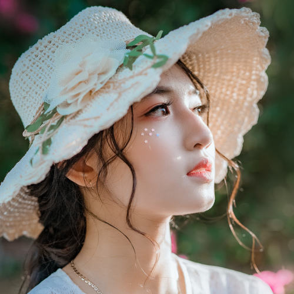
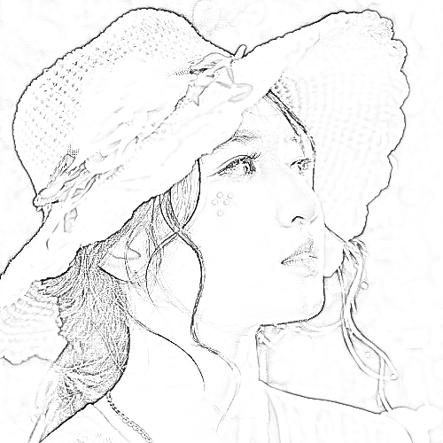

<!-- README.md is generated from README.Rmd. Please edit that file -->

```{r, include = FALSE}
knitr::opts_chunk$set(
  collapse = TRUE,
  comment = "#>",
  fig.path = "man/figures/README-",
  out.width = "100%",
  dpi=130
)
```

# sketcher

<!-- badges: start -->
<!-- badges: end -->

By using the ```sketcher``` package, you can convert a photo into a line drawing image. 
Drawing style (lineweight and texture smoothness) can be controlled.

## Paper

For details of this package, please refer to the article below:

Tsuda, H. (2020). sketcher: An R package for converting a photo into a sketch style image.  
https://psyarxiv.com/svmw5


## Dependencies

Mac OS X users need to install XQuartz (https://www.xquartz.org/).

## Installation

Please use ```devtools``` package to install ```sketcher``` package.

``` r
devtools::install_github("tsuda16k/sketcher")
```

(The ```sketcher``` package is currently under review by CRAN, so install.packages("sketcher") command does not work.)

Then, attach the package.

```{r}
library(sketcher)
```

## Example image and the "pplot" function

The ```sketcher``` package has a built-in image, which is useful when you want to try sketch effects right away. The image is named  ```face```.

To plot an image, use ```pplot()``` function. (Not ```plot```, but ```pplot```.)

```{r, eval=FALSE, echo=TRUE}
pplot(face)
```



## Load an image

To load your own image, use the ```im_load()``` function.

```{r, eval=FALSE, echo=TRUE}
im = im_load("path/to/your/image.jpg")
pplot(im)
```

The jpg, png, and bmp formats are supported. (The [imager](http://dahtah.github.io/imager/) package is used for image I/O.)

The built-in face image is used in the following examples.  
For consistency purposes, the ```face``` image is assigned to ```im```.

```{r}
im = face
```

## Apply the sketch effect

Use the ```sketch()``` function to apply the sketch effect.

```{r, eval=FALSE, echo=TRUE}
im2 = sketch(im) # may take some seconds
pplot(im2)
```



### Arguments of the sketch() function

The ```sketch()``` function has some arguments to control the drawing style:

```{r echo = F, results = 'asis'}
Argument = c("im", "style", "lineweight", "smoothing", "contrast", "gain")
Meaning = c( "An input image", "Either 1 (edge-focused) or 2 (shading preserving)", "Strength of lines",
             "Smoothness of image texture/gradient", "Adjusts the image contrast", "Can be used to reduce noise in dim regions" )
Default = c( "", "1", "1", "1", "16 (for style1) or 4 (for style2)", "0.1" )
doc_sketch = data.frame( Argument, Meaning, Default, stringsAsFactors = F )
library(knitr)
kable(doc_sketch)
```

The default is ```sketch(im, style = 1, lineweight = 1, smoothing = 1, contrast = 16, gain = 0.1)```.

While "style 1" focuses on edges and mostly removes shading, "style 2" tends to retain shading and has smooth luminance gradient transitions.

When the output sketch has low contrast (pale/whitish), then increase the contrast value.

### The effects of lineweight and smoothness

See the [this page](https://htsuda.net/sketcher/) for details.

## Saving the image

Use the ```im_save()``` function to save an image.

```{r, eval=F, echo=T}
im = face
im2 = sketch(im, style = 1, lineweight = 2, smoothing = 2)
im_save(im2, name = "myimage") # myimage.png is saved in the current working directory 
im_save(im2, name = "myimage" path = "set/your/path", format = "jpg", quality = .95)
```

When using ```format = "jpg"```, you can set the quality of jpg compression (default = 0.95).

## Misc

See the [this page](https://htsuda.net/sketcher/) for additional information.
