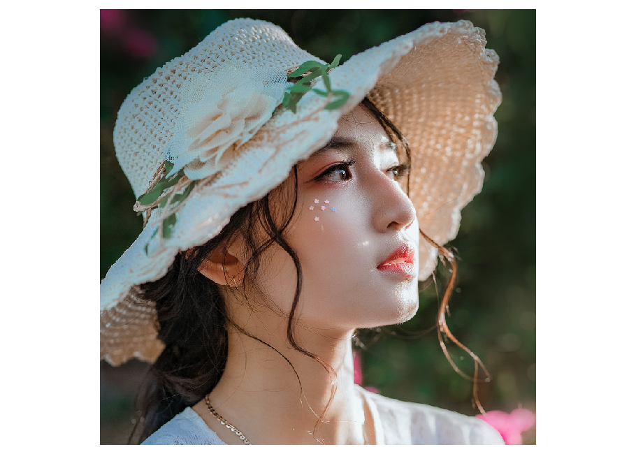
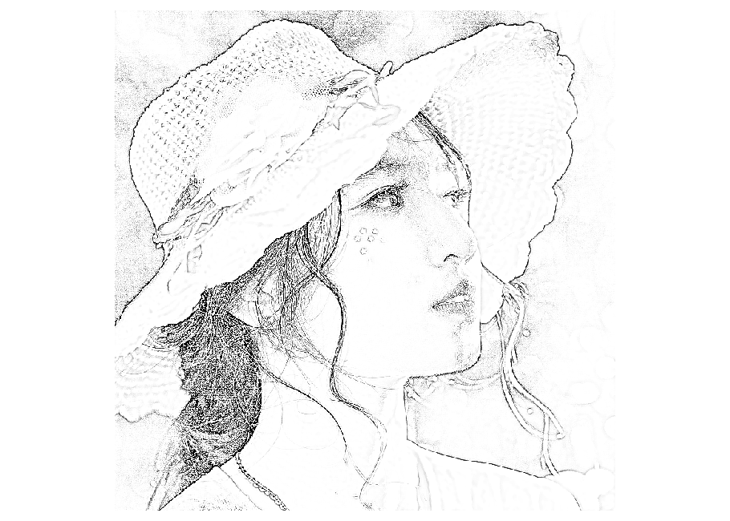

<!-- README.md is generated from README.Rmd. Please edit that file -->

# sketcher

<!-- badges: start -->

<!-- badges: end -->

By using the `sketcher` package, you can convert a photo into a line
drawing like image. Drawing style (lineweight and texture smoothness)
can be controlled.

## Dependencies

Mac OS X users need to install XQuartz (<https://www.xquartz.org/>).

## Installation

To install the CRAN release version of `sketcher`:

``` r
install.packages("sketcher")
```

Then, attach the package.

``` r
library(sketcher)
```

## Example image and the “pplot” function

The `sketcher` package has a built-in image, which is useful when you
want to try sketch effects right away. The image is named `face`.

To plot an image, use `pplot()` function. (Not `plot`, but `pplot`.)

``` r
pplot(face)
```



## Load an image

To load your own image, use the `im_load()` function.

``` r
im = im_load("path/to/your/image.jpg")
pplot(im)
```

The jpg, png, and bmp formats are supported. (The
[imager](http://dahtah.github.io/imager/) package is used for image
I/O.)

The built-in face image is used in the following examples.  
For consistency purposes, the `face` image is assigned to `im`.

``` r
im = face
```

## Apply the sketch effect

Use the `sketch()` function to apply the sketch effect.

``` r
im2 = sketch(im) # may take some seconds
pplot(im2)
```



### Arguments of the sketch() function

The `sketch()` function has some arguments to control the drawing
style:

| Argument   | Meaning                                        | Default |
| :--------- | :--------------------------------------------- | :------ |
| im         | An input image                                 |         |
| style      | Either 1 (edge-focused) or 2 (smooth gradient) | 1       |
| lineweight | Strength of lines                              | 1       |
| smoothness | Smoothness of image texture/gradient           | 1       |
| contrast   | Adjusts the image contrast                     | 7       |

The default is `sketch(im, style = 1, lineweight = 1, smoothing = 1,
contrast = 7)`.

While “style 1” focuses on edges and mostly removes shading, “style 2”
tends to retain shading and has smooth luminance gradient transitions.

### The effects of lineweight and smoothness

See the introduction vignette for details.

## Saving the image

Use the `im_save()` function to save an image.

``` r
im = face
im2 = sketch(im, style = 1, lineweight = 2, smoothing = 2)
im_save(im2, name = "myimage") # myimage.png is saved in the current working directory 
im_save(im2, name = "myimage" path = "set/your/path", format = "jpg", quality = .95)
```

When using `format = "jpg"`, you can set the quality of jpg compression
(default = 0.95).
