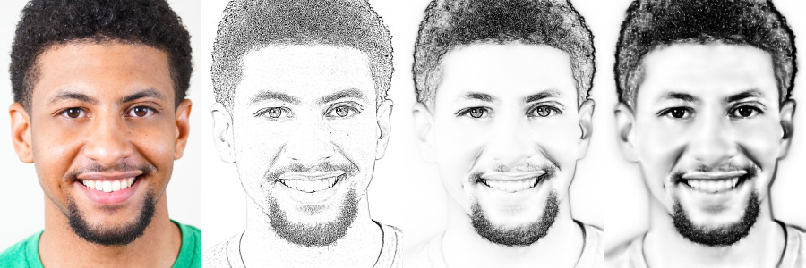
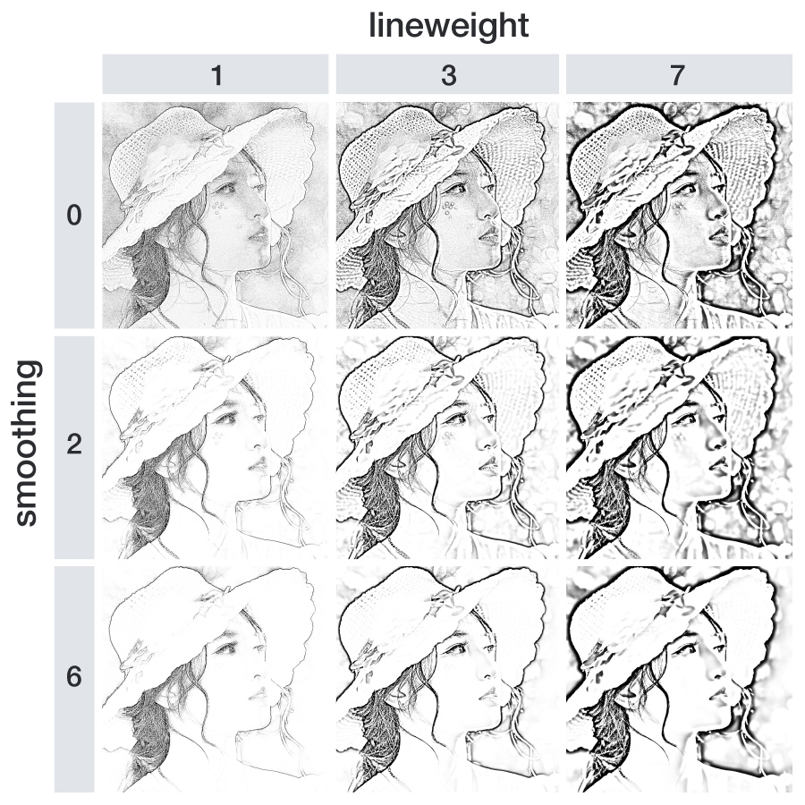
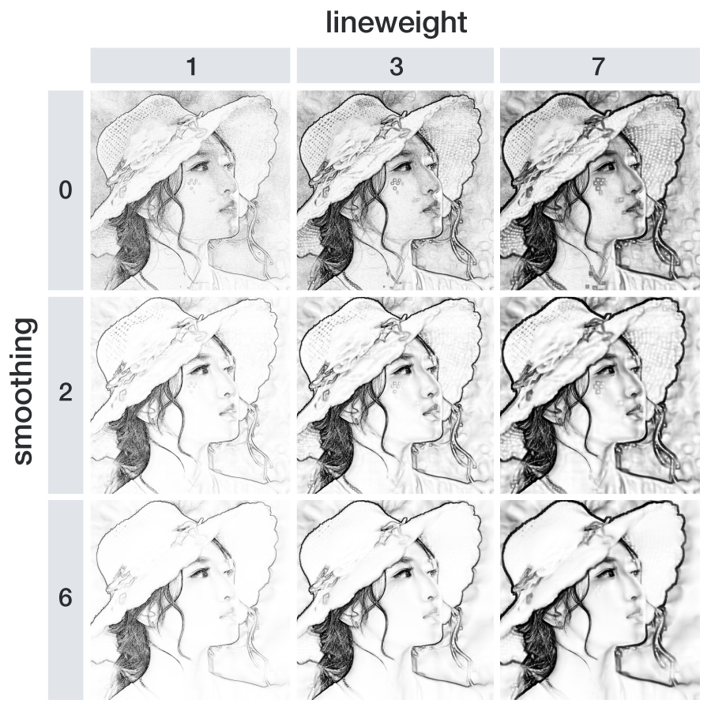

```{r, include = FALSE}
knitr::opts_chunk$set(
  message = FALSE,
  warning = FALSE,
  collapse = TRUE,
  comment = "#>"
)
```

## Introduction

By using the ```sketcher``` package, you can convert a photo into a line drawing like image. 
Drawing style (lineweight and texture smoothness) can be controlled. See some examples below.



## Paper

For details of this package, please refer to the article below:

Tsuda, H. (2020). sketcher: An R package for converting a photo into a sketch style image.  
https://psyarxiv.com/svmw5

## Dependencies

Mac OS X users need to install XQuartz (https://www.xquartz.org/).

## Preparation

After the installation of the package, call the ```library()``` function.

```{r}
library(sketcher)
```

## Example image and the "pplot" function

The ```sketcher``` package has a built-in image, which is useful when you want to try sketch effects right away. The image is named ```face```.

To plot an image, use ```pplot()``` function. (Not ```plot```, but ```pplot```.)

```{r}
pplot(face)
```

## Load an image

To load your own image, use the ```im_load()``` function.

```{r, eval=FALSE, echo=TRUE}
im = im_load("path/to/your/image.jpg")
pplot(im)
```

The jpg, png, and bmp formats are supported. (The [imager](http://dahtah.github.io/imager/) package is used for image I/O.)

The built-in face image is used in the following examples.  
For consistency purposes, the ```face``` image is assigned to ```im```.

```{r}
im = face
```

## Apply the sketch effect

Use the ```sketch()``` function to apply the sketch effect.

```{r}
im2 = sketch(im) # may take some seconds
pplot(im2)
```

### Arguments of the sketch() function

The ```sketch()``` function has some arguments to control the drawing style:

```{r echo = F, results = 'asis'}
Argument = c("im", "style", "lineweight", "smoothing", "contrast")
Meaning = c( "An input image", "Either 1 (edge-focused) or 2 (shading preserving)", "Strength of lines",
             "Smoothness of image texture/gradient", "Adjusts the image contrast" )
Default = c( "", "1", "1", "1", "8 (for style1) or 3 (for style2)" )
doc_sketch = data.frame( Argument, Meaning, Default, stringsAsFactors = F )
library(knitr)
kable(doc_sketch, caption = "Arguments of sketch() function")
```

The default is ```sketch(im, style = 1, lineweight = 1, smoothing = 1, contrast = 8)```.

While "style 1" focuses on edges and mostly removes shading, "style 2" tends to retain shading and has smooth luminance gradient transitions.

In most cases, higher values of contrast is preferred for the style1 sketch.

### The effects of lineweight and smoothness

By using the ```survey()``` function, you can create multiple sketches that have different style parameters and combine those sketches into a single image.

This function is useful when you want to find optimal sketch style parameters for your image.

Set style parameter values that you want to survey to ```weight_levels``` and ```smooth_levels``` arguments.

#### Survey of style 1

```{r, eval=F, echo=T}
# Create a survey image for style1
s1 = survey(im, style = 1, weight_levels = c(1, 3, 7), smooth_levels = c(0, 2, 6), contrast = 12)
pplot(s1)
```



(Note that text labels and spacing between sketches in the above figure were added manually for illustration purposes.)

#### Survey of style 2

```{r, eval=F, echo=T}
# Create a survey image for style2
s2 = survey(im, style = 2, weight_levels = c(1, 3, 7), smooth_levels = c(0, 2, 6), contrast = 2)
pplot(s2)
```



## Saving the image

Use the ```im_save()``` function to save an image.

```{r, eval=F, echo=T}
im = face
im2 = sketch(im, style = 1, lineweight = 2, smoothing = 2)

im_save(im2, name = "myimage") # myimage.png is saved in the current working directory 
im_save(im2, name = "myimage" path = "set/your/path", format = "jpg", quality = .95)
```

When using ```format = "jpg"```, you can set the quality of jpg compression (default = 0.95).
